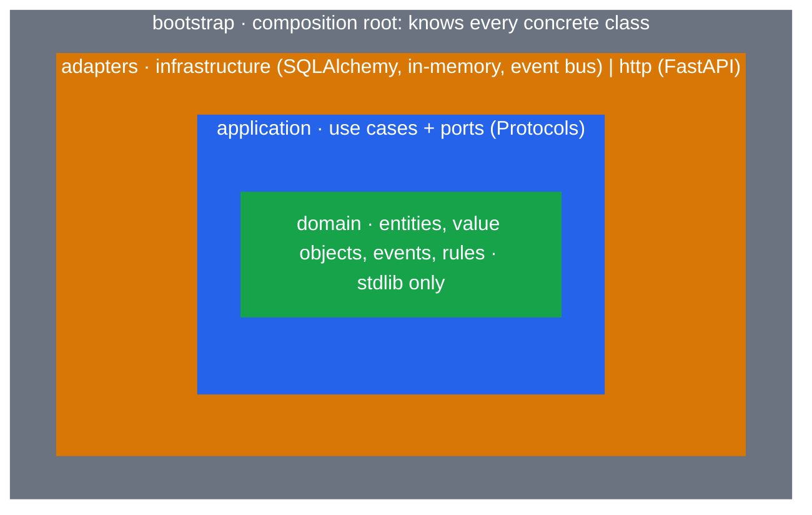
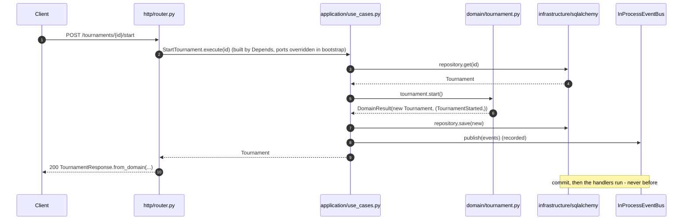

# Python Clean Architecture Template

[](https://github.com/davidcohenDC/python-clean-architecture-template/actions/workflows/dispatcher.yml)
[](https://codecov.io/gh/davidcohenDC/python-clean-architecture-template)
[](https://www.python.org/downloads/)
[](https://github.com/astral-sh/ruff)
[](https://mypy.readthedocs.io/)
[](https://conventionalcommits.org)
[](LICENSE)

**A working starter kit, a reference implementation and a practical guide to Clean
Architecture in modern Python - in one repository.**

FastAPI · SQLAlchemy 2 async · Alembic · uv · Ruff · mypy strict · pytest ·
executable architecture tests · Docker · GitHub Actions · semantic-release · Docusaurus docs

📖 **[Documentation](https://davidcohendc.github.io/python-clean-architecture-template/)** ·
[Architecture](https://davidcohendc.github.io/python-clean-architecture-template/architecture/overview) ·
[Decisions (ADR)](https://davidcohendc.github.io/python-clean-architecture-template/decisions) ·
[Replace the example domain](https://davidcohendc.github.io/python-clean-architecture-template/guides/replace-example-domain)

---

## Don't trust the architecture diagram. Run it.

```bash
make proof
```

```text
ARCHITECTURE PROOF

  Dependency rule                       PASS         ADR-001, ADR-006
  Feature isolation                     PASS         ADR-001
  Repository contract                   PASS         ADR-008
  Optimistic concurrency                PASS         ADR-010
  Transaction boundary                  PASS         ADR-004
  Events after commit                   PASS         ADR-005
  Authorization in the application ring PASS         ADR-009
  HTTP error contract                   PASS         no ADR
  Example removal                       PASS         ADR-001

9/9 executable guarantees passed
```

Every "clean architecture" repository has the folders and the diagram. This one has a
short list of **specific, falsifiable guarantees**, each backed by real tests you can read,
each traced to the decision it implements, and a command that runs exactly those tests and
fails the build when one stops being true. The list lives in [`proofs.toml`](proofs.toml);
`make proof` cannot be green by default: a guarantee with no evidence is reported as such.

| Guarantee | What is checked | Where |
|---|---|---|
| `proof:dependency-rule` | every module imports inward; `domain`/`application` import nothing third-party; falsified on 13 synthetic violations | `tests/architecture` |
| `proof:feature-isolation` | no feature imports another; `shared` imports no feature | `tests/architecture` |
| `proof:repository-contract` | in-memory and SQL repositories pass the same contract | `tests/integration` |
| `proof:optimistic-concurrency` | two readers race on one row: the stale write raises `ConflictError`, HTTP says 409 | `tests/integration`, `tests/api` |
| `proof:transaction-boundary` | commit before the response is sent; failed commit → 500, nothing persisted | `tests/api` |
| `proof:events-after-commit` | handlers run after commit and see committed rows; rollback dispatches nothing | `tests/api`, `tests/cli` |
| `proof:authorization-in-application` | who may act is decided on an `Actor` in use cases, testable without HTTP | `tests/application`, `tests/api` |
| `proof:error-contract` | one error envelope for 404/405/500, request id on every response | `tests/api` |
| `proof:example-removal` | `init_project.py --remove-example` leaves a project that lints, tests, migrates and serves | `tests/scripts` |

**What this is not.** It is not a proof that the architecture is *correct*, complete or
suited to your problem, and it does not cover what your own code will do. It is the list of
properties this template promises, kept honest by CI. Decisions without a runtime property
(no DI library, no mediator, the stack) say so in their ADR: `No executable proof`.

## Quick start

```bash
git clone https://github.com/davidcohenDC/python-clean-architecture-template
cd python-clean-architecture-template
make install        # uv sync + git hooks
make run            # migrations + uvicorn with reload → http://localhost:8000/docs
```

No database? `make run-memory`. PostgreSQL? `docker compose up`. Everything CI runs: `make check`.

<details>
<summary>Without <code>make</code></summary>

```bash
uv sync --all-extras
git config core.hooksPath .githooks
uv run alembic upgrade head
uv run uvicorn cleanarch.main:app --reload
```
</details>

## The architecture in one picture



**Dependencies point inward, always.** `infrastructure`, `http` and `cli` sit on the same ring
and never import each other; they meet only in `bootstrap`. The example feature is driven by
both an HTTP router and a command line (`python -m cleanarch tournaments ...`) that call the
same use cases through the same ports.



## Project layout

```text
src/cleanarch/
├── shared/           TEMPLATE  building blocks: DomainEvent, DomainResult, errors,
│                               EventPublisher port, DB session, in-process bus, HTTP error mapping
├── tournaments/      EXAMPLE   one feature, four rings:
│   ├── domain/                 Tournament aggregate, phases, progress, events, rules
│   ├── application/            use cases, TournamentRepository port, command, authorization
│   ├── infrastructure/         in_memory.py · sqlalchemy/{models,mapping,repository}.py
│   ├── http/                   router, schemas, use-case factories
│   └── cli/                    the same use cases from the terminal
├── bootstrap/        TEMPLATE  settings · logging · transaction middleware · app.py · cli.py
├── main.py                     uvicorn cleanarch.main:app
└── __main__.py                 python -m cleanarch

tests/
├── domain/           pure rules, no I/O                          ms
├── application/      use cases with the in-memory adapter        ms
├── integration/      repository contract: in-memory + SQL      ~100 ms
├── api/              HTTP boundary, auth, ops, HTTP→DB on SQLite   ms
├── cli/              command line on a SQLite file              ms
└── architecture/     the Dependency Rule, executable             ms
```

## The example feature

A tournament is a sequence of phases (Swiss/round-robin rounds, single/double elimination
brackets), each after the first preceded by a top-N cut. It can be created, started and
advanced round by round until it finishes. Real invariants, real state machine, real events -
readable in five minutes.

<details>
<summary>Glossary, if you don't play tournaments</summary>

- **Swiss / round-robin** - pairing systems for round-based phases: everybody plays a fixed number of rounds.
- **Bracket** - knock-out phase: single elimination (lose once, out) or double.
- **Cut** - who advances into a later phase, e.g. *top 8*. The first phase has no cut; every later phase needs one.
- **Progress** - where the tournament is: not started, phase *i* / round *j*, or finished.
</details>

```bash
curl -s -X POST localhost:8000/api/v1/tournaments -H 'content-type: application/json' -d '{
  "name": "Spring Cup",
  "phases": [
    {"config": {"kind": "round", "rounds": 2, "pairing": "swiss"}},
    {"config": {"kind": "bracket", "elimination": "single"}, "cut": {"players": 8}}
  ]}'
curl -s -X POST localhost:8000/api/v1/tournaments/<id>/start
curl -s -X POST localhost:8000/api/v1/tournaments/<id>/advance
curl -s -X POST localhost:8000/api/v1/tournaments/<id>/start
# → 422 {"error": "TournamentAlreadyStarted", "message": "Tournament has already started."}
```

The whole use case:

```python
class StartTournament:
    def __init__(self, repository: TournamentRepository, events: EventPublisher) -> None:
        self._repository = repository
        self._events = events

    async def execute(self, tournament_id: TournamentId) -> Tournament:
        tournament = await _require(self._repository, tournament_id)
        result = tournament.start()  # DomainResult: new aggregate + events
        await self._repository.save(result.aggregate)
        await self._events.publish(result.events)
        return result.aggregate
```

## Make it yours

```bash
uv run python scripts/init_project.py --name shopapi --remove-example   # rename + drop the example
uv run python scripts/new_feature.py orders                             # scaffold a feature
make check                                                              # still green
```

`new_feature.py` generates a working vertical slice - entity, event, repository port, two use
cases, in-memory adapter, router - that already passes the architecture tests. Wire two
lines in `bootstrap/app.py` and `POST /api/v1/orders` works.

## Design decisions

| Decision | Why | Add it when... | ADR |
|---|---|---|---|
| Feature-first layout, rings inside | delete a feature = delete a folder; rings still enforced per feature | - | [001](docs/docs/decisions/001-feature-first-layout.md) |
| No DI library | `Depends` + `dependency_overrides` in one composition root; nothing to learn | the object graph gets deep | [002](docs/docs/decisions/002-no-di-library.md) |
| No mediator / CQRS bus | use cases are classes you call; greppable | several entrypoints need one pipeline | [003](docs/docs/decisions/003-no-mediator-no-cqrs.md) |
| Transaction per request, no UoW | session opened/committed by the HTTP layer; use cases stay 4 lines | two aggregates per operation, or non-HTTP entrypoints | [004](docs/docs/decisions/004-transaction-per-request.md) |
| Events in-process, after commit | values returned by domain methods, dispatched once the transaction committed; at-most-once | a handler must survive a crash or be retried (outbox) | [005](docs/docs/decisions/005-events-in-process.md) |
| FastAPI + SQLAlchemy 2 + Alembic + uv + Ruff + mypy | mainstream, typed, confined to the outer rings | - | [006](docs/docs/decisions/006-stack.md) |
| Shape in Pydantic, rules in the domain | one source of truth per rule, on every entry path | - | [007](docs/docs/decisions/007-validation-placement.md) |
| Separate row model + explicit mapping | frozen dataclass domain; table evolves independently | - | [008](docs/docs/decisions/008-persistence-model.md) |
| Auth is an adapter, authorization a rule | API key → `Actor`; use cases decide; domain records `organizer_id` | JWT/OAuth: swap one file | [009](docs/docs/decisions/009-authentication-as-adapter.md) |
| Optimistic concurrency on every adapter | `version` checked on `save`; stale write → `409`, never a lost update | - | [010](docs/docs/decisions/010-optimistic-concurrency.md) |

## Tooling

| | |
|---|---|
| `make proof` | the executable architecture guarantees, one verdict each (~20 s) |
| `make graph` | regenerate the dependency graph page from the code |
| `make test` / `make test-fast` | full suite with coverage / domain + application + architecture only |
| `make lint` / `make format` / `make typecheck` | Ruff, Ruff --fix, mypy --strict |
| `make migrate` / `make migration m="..."` | Alembic upgrade / autogenerate |
| `make docs` | Docusaurus dev server |
| `docker compose up` | API + PostgreSQL 17 |
| `.githooks/` / `.pre-commit-config.yaml` | `commit-msg` enforces Conventional Commits; `pre-commit` runs the fast checks (bash hooks or the pre-commit framework, your choice) |
| `.github/workflows/` | lint · tests on 3 OS × 2 Pythons · Postgres integration · Docker smoke test · docs · semantic-release · GHCR image |

Releases are automatic: Conventional Commits on `main` → version, `CHANGELOG.md`, tag, GitHub
release and `ghcr.io/<owner>/<repo>:X.Y.Z`. See [CONTRIBUTING.md](CONTRIBUTING.md).

## How it compares

We benchmarked the popular Python Clean Architecture / DDD repositories and the most-starred
templates in other ecosystems before settling the structure. The short version is in the
[docs](https://davidcohendc.github.io/python-clean-architecture-template/benchmark); the one-line
version:

> Boundaries verified by tests that run in CI, an example domain removed with one command,
> and a written reason for every pattern present - or absent. We have not found another
> Python template that does all three; if you know one, open an issue and we will link it.

## Contributing

Issues and PRs are welcome. Read [CONTRIBUTING.md](CONTRIBUTING.md) first - the bar is
"does it make the architecture clearer for the next person who forks it?".

## License

[MIT](LICENSE). Free to use, fork and ship. If it saved you time, a star helps others find it.
