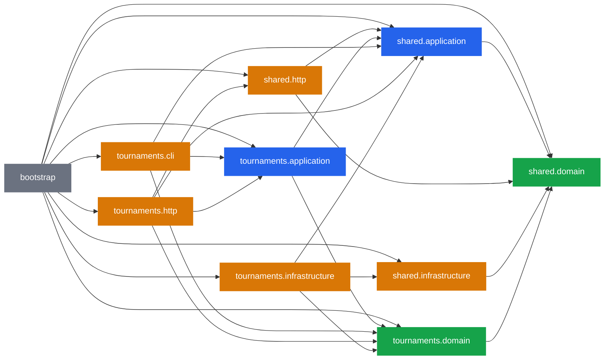

# Dependency graph, generated from the code

Every arrow below is a real `import` found by the same parser that enforces the
[Dependency Rule](testing#architecture-a-tool-and-optionally-a-test) - not a
drawing of intent. Regenerate with `make graph`; in the template repository
`tests/template/test_graph.py` fails when this file is stale.

