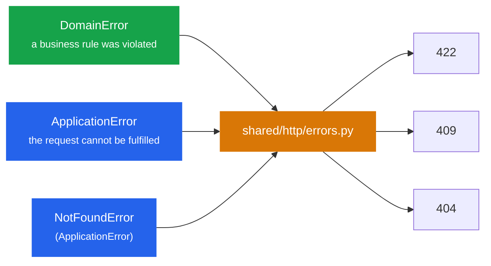

# Errors

Three families, one per ring, and one place that maps them to HTTP.



## Domain errors are named after the rule

```python title="tournaments/domain/errors.py"
class TournamentAlreadyStarted(DomainError):
    message = "Tournament has already started."
```

Not `TournamentError("already started")`. A specific type means:

- tests assert on the type, not on a string;
- the HTTP response carries a stable, machine-readable `error` field
  (`{"error": "TournamentAlreadyStarted", "message": "..."}`);
- the API layer can map one rule to a different status code if 422 is wrong for it,
  with `register_error(app, TournamentAlreadyStarted, 409)`.

The `...Error` suffix is deliberately *not* used for domain rules; ruff's `N818` is disabled
for that reason.

## Application errors describe the request

`TournamentNotFound(NotFoundError)` is raised by use cases, never by the domain: the domain
does not know that ids can be looked up. Other `ApplicationError`s (a conflict, a permission
problem) map to 409 by default.

## Nothing else crosses the boundary

- Repositories raise nothing domain-specific. A missing row is `None`; the use case turns it
  into `TournamentNotFound`.
- Infrastructure exceptions (`sqlalchemy.exc.*`, connection errors) are not translated: they
  are bugs or outages, they become a logged 500, and the transaction rolls back.
- Pydantic validation errors stay FastAPI's native 422 with a `detail` list, because clients
  and tooling already understand that format.

## Validation: shape vs rules

| Kind | Where | Example |
|---|---|---|
| Shape | Pydantic schema (`http/schemas.py`) | `rounds` must be an int; `kind` must be `round` or `bracket` |
| Rule | Domain (`__post_init__`, methods) | `rounds` must be 1-20; the first phase has no cut; can't start twice |

A rule belongs to the domain even when it is easy to express in Pydantic, because the domain
must hold on every entry path (HTTP today, a CSV import tomorrow). See
[ADR-007](../decisions/007-validation-placement).
