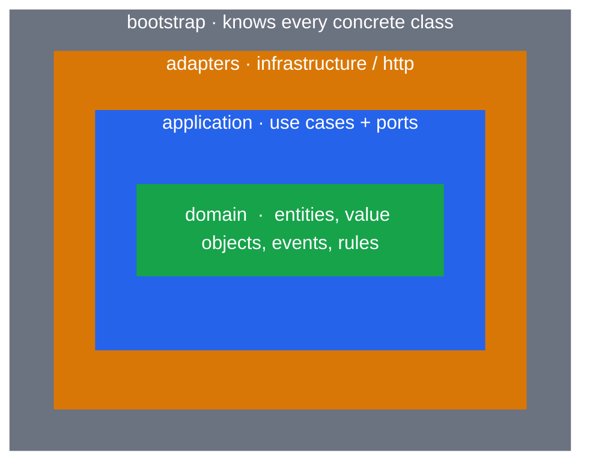
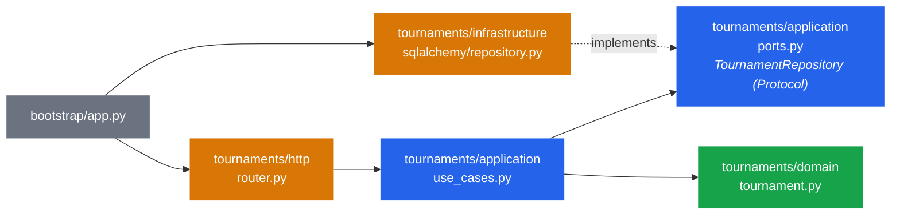

# Architecture overview

Clean Architecture is one rule with a diagram attached:

> **Source code dependencies must point only inward, toward higher-level policies.**

Everything else - layers, ports, adapters, DTOs - exists to make that rule easy to follow.

## The rings



| Ring | Contains | May import | Knows about |
|---|---|---|---|
| <span className="ring ring--domain">domain</span> | entities, value objects, domain events, domain errors | stdlib, `shared.domain` | nothing outside itself |
| <span className="ring ring--application">application</span> | use cases, commands, ports (Protocols), application errors | domain, `shared.application` | *that* a repository exists, not *which* |
| <span className="ring ring--adapters">infrastructure</span> | implementations of ports: SQLAlchemy, in-memory, event bus | application, domain, any library | the database, the broker |
| <span className="ring ring--adapters">http</span> | FastAPI routers, Pydantic schemas, use-case factories | application, domain, FastAPI | HTTP, JSON |
| <span className="ring ring--bootstrap">bootstrap</span> | settings, `create_app()` | everything | which adapter serves which port |

`infrastructure` and `http` are siblings on the same ring: **neither imports the other**.
They only meet in `bootstrap`.

## Dependency direction, concretely



The arrow from `infrastructure` to `ports` is the **Dependency Inversion**: the use case
defines the interface it needs; the adapter conforms to it. At runtime control flows
*outward* (use case calls the repository), but the *source dependency* points *inward*
(the repository module imports the port, never the reverse).

## Feature-first, rings inside

Rather than four top-level folders each containing a slice of every feature, each feature
owns its four rings:

```text
tournaments/domain  tournaments/application  tournaments/infrastructure  tournaments/http
orders/domain       orders/application       orders/infrastructure       orders/http
shared/domain       shared/application       shared/infrastructure       shared/http
```

Consequences:

- Deleting the example is `rm -rf tournaments/` (plus three marked blocks).
- A feature cannot import another feature. If two need the same thing, it goes to `shared/`
  or they talk through a port. The architecture tests enforce this.
- The rings are still visible - the Dependency Rule applies *within* each feature and
  across `shared`.

See [ADR-001](../decisions/001-feature-first-layout).

## What "clean" buys you here

- **Domain tests run in milliseconds** with no fixtures, because the domain has no dependencies.
- **Use cases are tested with the real in-memory adapter**, no mocking framework.
- **Swapping SQLite for PostgreSQL is a URL**; swapping SQLAlchemy for anything else is one
  file in `infrastructure/` and one line in `bootstrap`.
- **FastAPI is confined to `http/` and `bootstrap/`**. A CLI or a message consumer would be
  another adapter calling the same use cases.

## What it deliberately does not do

- No DI container: FastAPI's `Depends` plus explicit overrides in `bootstrap` ([ADR-002](../decisions/002-no-di-library)).
- No mediator / command bus / CQRS split ([ADR-003](../decisions/003-no-mediator-no-cqrs)).
- No Unit of Work: one transaction per request ([ADR-004](../decisions/004-transaction-per-request)).
- No outbox or broker: events are dispatched in-process ([ADR-005](../decisions/005-events-in-process)).

Each ADR states the condition under which the omitted pattern becomes worth its cost.
