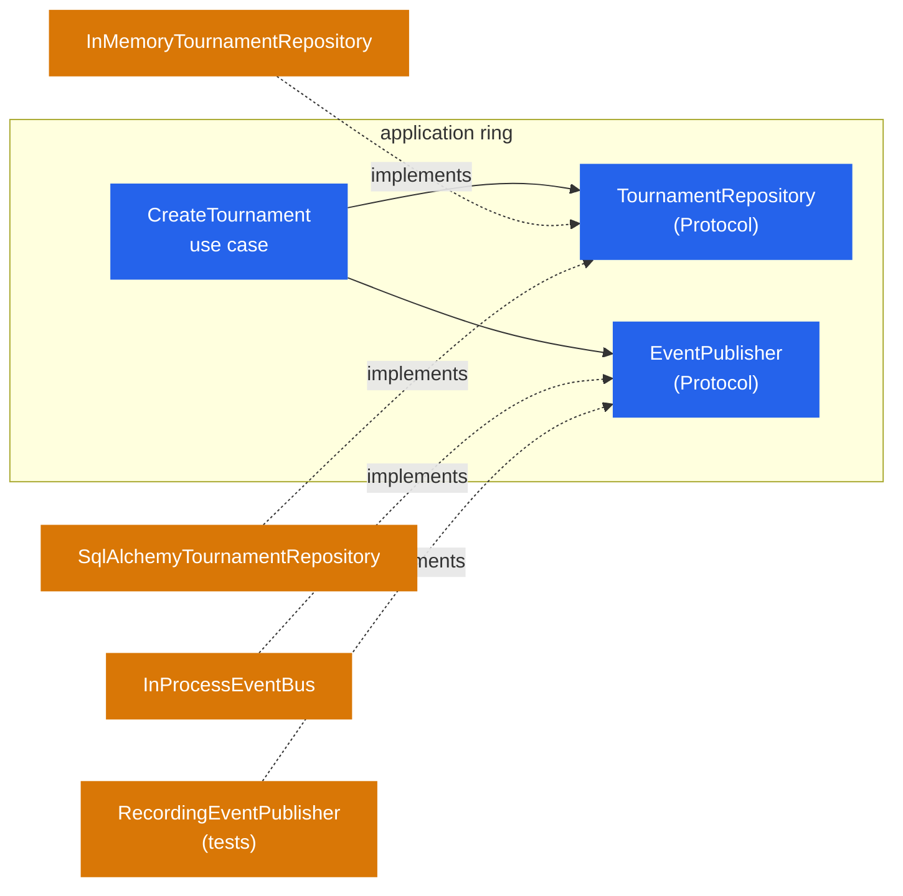

# Ports and adapters

A **port** is an interface owned by the inside. An **adapter** is an implementation owned by
the outside. The inside never knows which adapter is plugged in.



## Ports are `Protocol`s

```python title="tournaments/application/ports.py"
class TournamentRepository(Protocol):
    async def add(self, tournament: Tournament) -> None: ...
    async def get(self, tournament_id: TournamentId) -> Tournament | None: ...
    async def save(self, tournament: Tournament) -> None: ...
    async def list(self, *, limit: int, offset: int) -> Sequence[Tournament]: ...
```

Why `typing.Protocol` and not an abstract base class?

- Adapters do not need to inherit from anything, so a test fake is just a class with the
  right methods.
- mypy checks conformance structurally: `SqlAlchemyTournamentRepository` is accepted wherever
  a `TournamentRepository` is expected because it *has the methods*, and you get an error at
  the composition root if it doesn't.
- The port stays in the application ring with zero coupling to its implementations.

## Ports live where they are used

The repository port is in `tournaments/application/`, not in `domain/`: it is the use case
that needs persistence, the domain does not. `EventPublisher` and `Clock` are in
`shared/application/` because every feature publishes events and reads time the same way.

`Clock` is the smallest possible port and shows the pattern end to end: `SystemClock` in
`shared/infrastructure/clock.py`, `FixedClock` for tests, `created_at` handed to the domain
as a value so that `Tournament.create(...)` stays pure and deterministic.

If a use case needs a clock, a mailer, a payment gateway: add a `Protocol` next to
`TournamentRepository`, take it in the use case's constructor, implement it in
`infrastructure/`, wire it in `bootstrap`.

## Two adapters, one port

The template ships two implementations of `TournamentRepository` on purpose:

| Adapter | Used by | Why it exists |
|---|---|---|
| `InMemoryTournamentRepository` | application tests, API tests, `DATABASE_URL=memory://` | proves the use cases don't care about SQL; makes tests fast and deterministic |
| `SqlAlchemyTournamentRepository` | default runtime, integration tests | the real thing |

They are interchangeable at the composition root and nowhere else has to know.

## Wiring: placeholder dependencies + overrides

Each feature declares its ports as plain functions that raise:

```python title="tournaments/http/dependencies.py"
def get_tournament_repository() -> TournamentRepository:
    raise NotImplementedError("Provided by cleanarch.bootstrap (dependency_overrides)")
```

and builds use cases from them:

```python
Repository = Annotated[TournamentRepository, Depends(get_tournament_repository)]
Events = Annotated[EventPublisher, Depends(get_event_publisher)]

def start_tournament(repository: Repository, events: Events) -> StartTournament:
    return StartTournament(repository, events)
```

`bootstrap/app.py` decides what the placeholders resolve to:

```python title="bootstrap/app.py"
if settings.use_in_memory:
    repository = InMemoryTournamentRepository()
    app.dependency_overrides[get_tournament_repository] = lambda: repository
else:
    def sqlalchemy_repository(session: Session) -> TournamentRepository:
        return SqlAlchemyTournamentRepository(session)
    app.dependency_overrides[get_tournament_repository] = sqlalchemy_repository
```

Tests override the same way. No container, no decorators, no registration by import
side-effect. See [ADR-002](../decisions/002-no-di-library) for the trade-offs.

## Driving vs driven

In hexagonal terms:

- **Driving adapters** call use cases: the FastAPI router today; a CLI, a scheduler or a
  message consumer tomorrow. They live in `http/` (or `cli/`, `consumers/`...).
- **Driven adapters** are called by use cases through ports: repositories, the event bus.
  They live in `infrastructure/`.

Both are on the same ring, both are replaceable, and they never import each other.
