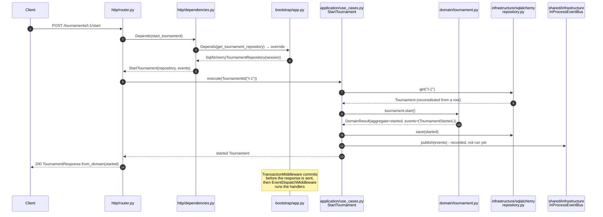

# How a request flows

`POST /api/v1/tournaments/{id}/start`, end to end.

## Step by step

1. **Routing and parsing** - FastAPI matches the path and validates the request body
   (`CreateTournamentRequest` for the POST that creates one; here there is no body).
   Pydantic checks *shape*, not business rules.

2. **Resolving the use case** - the handler declares
   `use_case: Annotated[StartTournament, Depends(deps.start_tournament)]`. That factory in
   `http/dependencies.py` asks for two ports: a `TournamentRepository` and an
   `EventPublisher`. Both are *placeholder* dependencies that `bootstrap` overrode with real
   providers when it built the app. This is the only "magic" in the template and it is
   FastAPI's own, documented mechanism.

3. **Executing** - `StartTournament.execute()` loads the aggregate through the port, calls
   `tournament.start()` on it, persists the returned aggregate, publishes the returned
   events. Four lines. No framework in sight.

4. **Domain logic** - `Tournament.start()` delegates to `Progress.start(phases)`, which raises
   `TournamentAlreadyStarted` if needed, and returns a **new** `Tournament` plus a
   `TournamentStarted` event inside a `DomainResult`. Nothing is mutated.

5. **Persisting** - `SqlAlchemyTournamentRepository.save()` maps the aggregate to the row model
   and flushes. It never commits: the session it received belongs to the request.

6. **Events** - `publish()` only *records* the events in the request's `CollectedEvents`.
   Nothing runs yet: handlers need committed state.

7. **Presenting** - the router converts the domain object to `TournamentResponse` and FastAPI
   serialises it. The domain object never reaches the wire directly.

8. **Transaction boundary** - `TransactionMiddleware` (in `bootstrap/transaction.py`)
   opened the session before routing. When the handler returns a `2xx`/`3xx` it commits
   *before* the response leaves the process; on `4xx`/`5xx` or an exception it rolls back;
   if the commit itself fails the client gets `500 TransactionFailed` instead of a false
   success. See [ADR-004](../decisions/004-transaction-per-request).

9. **Event dispatch** - only after a successful commit, `EventDispatchMiddleware` hands the
   collected events to `InProcessEventBus`, which runs the subscribers in order (in the
   example, one that logs "Tournament is live"). A failing subscriber is logged with the
   request id and does not change the response; a rolled-back request dispatches nothing.
   See [ADR-005](../decisions/005-events-in-process).

## What happens on errors

| Raised where | Exception | Becomes |
|---|---|---|
| Pydantic (shape) | `RequestValidationError` | `422` with FastAPI's `detail` list |
| domain | `DomainError` subclass | `422` `{"error": "TournamentAlreadyStarted", "message": ...}` |
| application | `NotFoundError` subclass | `404` `{"error": "TournamentNotFound", ...}` |
| application | `ForbiddenError` | `403` (only the organizer or an admin runs a tournament) |
| repository | `ConflictError` | `409` (someone else saved a newer version first; reload and retry) |
| http adapter | `HTTPException(401)` | `401` from `shared/http/auth.py` when `API_KEYS` is set |
| application | other `ApplicationError` | `409` |
| framework | unknown route / wrong method | `404` / `405` in the envelope (405 keeps `Allow`) |
| anywhere | anything else | `500` in the envelope, logged with traceback and request id |

See [Errors](errors) for the reasoning.
