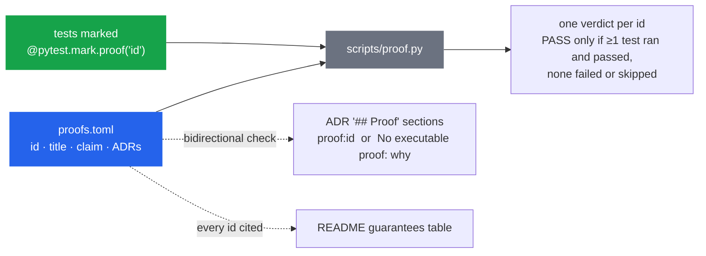

# Executable guarantees: `make proof`

Architectural claims are executable here, not merely documented. `make proof` runs the tests
that back each guarantee in [`proofs.toml`](https://github.com/davidcohenDC/python-clean-architecture-template/blob/main/proofs.toml)
and prints one verdict per guarantee:

```text
ARCHITECTURE PROOF

  Dependency rule                         PASS         ADR-001, ADR-006
  Feature isolation                       PASS         ADR-001
  Repository contract                     PASS         ADR-008
  Optimistic concurrency                  PASS         ADR-010
  Transaction boundary                    PASS         ADR-004
  Events after commit                     PASS         ADR-005
  Authorization in the application ring   PASS         ADR-009
  HTTP error contract                     PASS         no ADR
  Example removal                         PASS         ADR-001

9/9 executable guarantees passed in 17.5s
```

Exit code `0` only when every guarantee is `PASS`; `1` when one is `FAIL`, `SKIPPED` or
`NO EVIDENCE`; `2` when the registry itself is inconsistent.

## How it is wired



Three moving parts, no duplication:

1. **`proofs.toml`** is the registry: a stable id, a human title, the one-sentence claim, and
   the ADRs that made the decision.
2. **Evidence** is ordinary tests carrying `@pytest.mark.proof("<id>")`. The runner deselects
   everything else, so `make proof` takes ~20 s.
3. **Traceability** is checked by `tests/proofs/test_registry.py` (and again by the runner
   before it starts): every ADR either cites `proof:<id>` lines or states
   `No executable proof: <reason>`; every id cited anywhere must exist; every registered id
   must appear in the README table; an ADR listed for a proof must cite it back.

## Falsifiable, on purpose

`tests/proofs/test_proof_system.py` proves the prover:

- a mapping broken in any direction is reported (unknown id in an ADR, in a test, in the
  README; ADR without a proof statement; non-reciprocated reference);
- a guarantee nothing ran for is `NO EVIDENCE`, never `PASS`; one failing or skipped test
  taints the whole guarantee;
- on a temporary copy of the repository, a smuggled import from `domain` into
  `infrastructure` turns `Dependency rule` red with exit code `1`, and the report names the
  module.

## Adding a guarantee

1. Write the test that would fail if the property were false.
2. Mark it `@pytest.mark.proof("my-guarantee")`.
3. Add `[my-guarantee]` to `proofs.toml` with `title`, `claim` and `adr`.
4. Add `- proof:my-guarantee` to the `## Proof` section of each ADR you listed.
5. Add a row to the README table.

`make proof` (and CI) will tell you if you skipped a step.

## After `--remove-example`

The guarantees whose evidence lived in the example (repository contract, concurrency,
transaction boundary, events, authorization) come back as `NO EVIDENCE` in your new project.
That is deliberate: they are properties of *a feature's adapters*, and your feature has to
prove them again - mark its tests, or drop the entries you do not need.

## What it does not claim

It does not prove that the architecture is correct, complete or right for your problem, and
it does not cover the code you will write. Decisions with no runtime property (no DI
library, no mediator, the stack, where validation lives) say so in their ADR.
